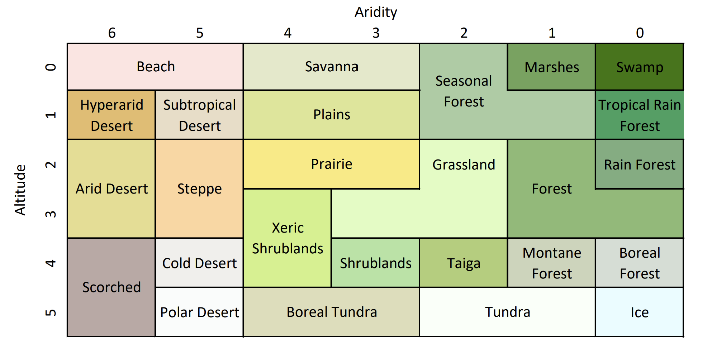

Randomly generates terrain on a sphere using OpenGL (via GLFW) and SDL2.

The process takes into account:

1. Heightmap (distance to nearest ocean)
2. Aridity map (distance to nearest fresh water source)
3. Tropics/Wind map (essentially a sinusoidal function with values affected by land height)

Mapped biomes:

